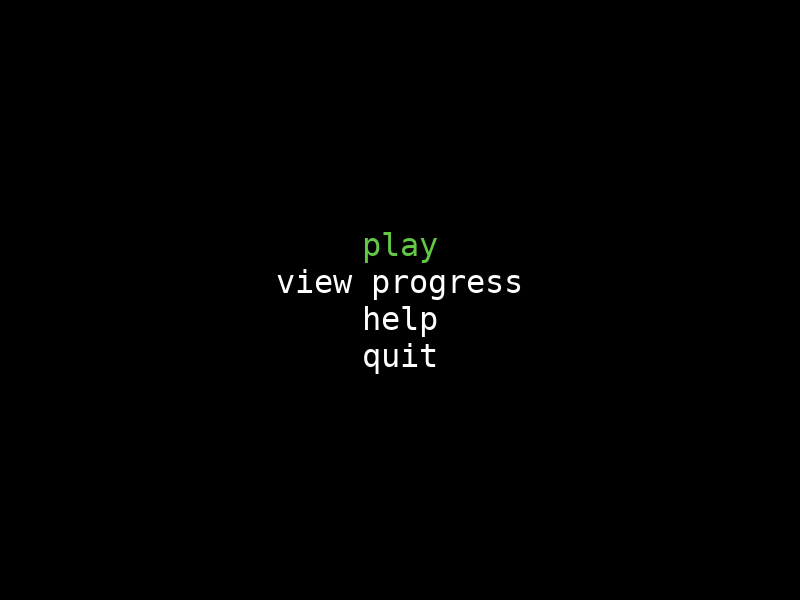
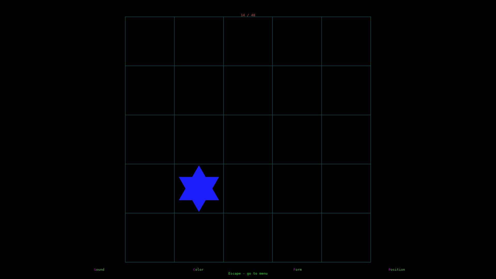
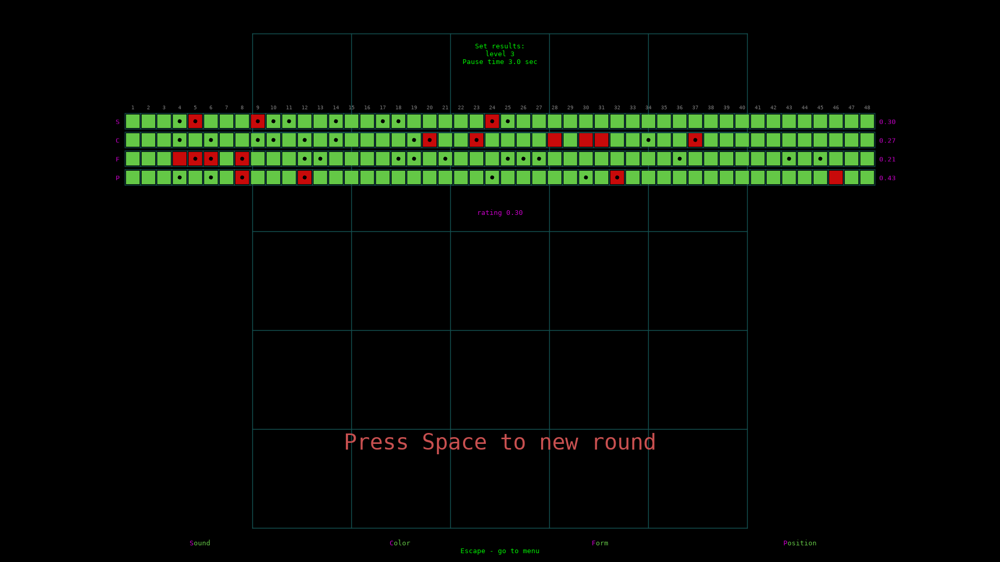
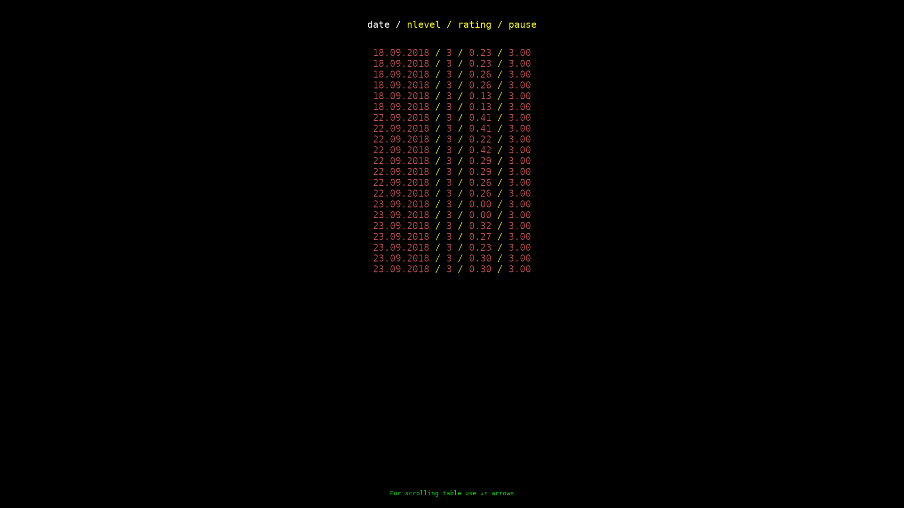

# README #

This is a [nback](https://en.wikipedia.org/wiki/N-back) training game.
Original [article](http://www.pnas.org/content/pnas/105/19/6829.full.pdf)

There are 4 type of signals - sound, position, color and figure form. You can setup
back level and pause between signals.

